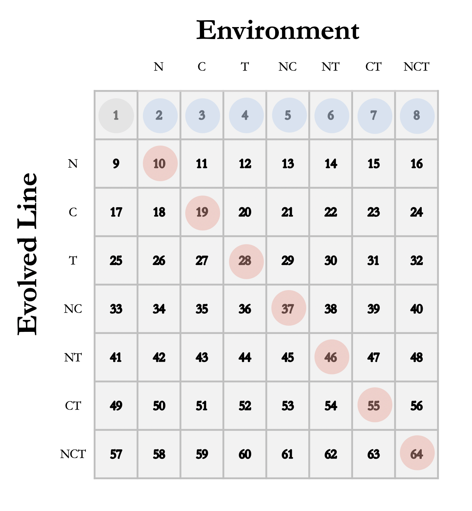

```{r, echo=FALSE, results='hide'}
# R version 4.0.2 (2020-06-22)

rm(list = ls())           # clear the environment 

# Packages
library(tidyverse)        # Organising and manipulating data
library(gsubfn)           # To use enhance list[] functionality
library(multcomp)         # To use glht() for dunnet post hoc test 

# Functions to calculate hedges effect size for interactions between stressors
source("Scripts/Hedges.Functions.R") 
```

### Intro

This R notebook contains the code used for the data analysis in the paper: *"Rapid evolution generates synergism between multiple stressors: linking theory and an evolution experiment"*. 

We are interested in two main questions: 

1. Do interactions between stressors change over time due to evolution?

2. How do populations respond when stressors they have evolved to are removed?


### Growth Rate Data

The raw data we are using is in *growth-data.csv* and the variables are: 

- *assay*: "2", "3" - two growth assays (replication). Not enough levels to be set as a random effect and no significant difference between the two. 
- *Environment*: 1-8 - 8 different environments (Con, Na, Cu, Temp, NaCu, NaTemp, CuTemp, All).
- *Population*: 1-32 - 4 replicates of each evolved line, missing three populations that went extinct during the experiment: 11 (Cu), 19 (NaCu), and 24 (NaTemp). 
- *evolline*: 1-8 - 8 evolved lines of rotifers (Con, Na, Cu, Temp, NaCu, NaTemp, CuTemp, All).
- *Replicate*: 1-12 - there were ~12 replicates per combination.  
- *Growth*: growth rate (% per day) as a measure of fitness

2x8x4x8x12 = 6144 observations - but due to the extinction of three populations and the fact that not all replicates worked we have a total of 5350 observations.

We carried out our analysis at the population level. Population growth rates is the response variable. This  allows us to carry out simple statistics that clearly explain our results and prevents any sort of pseudo-replication.

<br>

- **Import data and organise**

```{r, echo = TRUE}
rot_data <- read.csv("Data/growth_data.csv", 
                     header = TRUE, 
                     stringsAsFactors=FALSE)

# create a column representing interactions of evolline and environment
# Ordered along the rows of the original 64 panel plot with lex.order=TRUE 
rot_data$treat_fac <- interaction(rot_data$evolline, 
                                  rot_data$Environment, lex.order = TRUE)

# encode as numeric (from 1 to 64)
rot_data$treat_num <- as.numeric(rot_data$treat_fac)

# convert to tibble 
rot_data <- as_tibble(rot_data)
```

- **Calculate means (and standard error) of populations and create new data frame**

```{r, echo = TRUE, results = 'hide'}
# standard error function 
std.error <- function(x){ 
  return( sqrt( var(x) / length(x) ) ) 
  }

# create new dataframe based on mean population growth rates 
# add three variables for the three stressors - one-hot-encoding
rot_pop <- rot_data %>%
  group_by(Population, evolline, Environment, treat_num) %>%
  summarise(mean_growth = mean(Growth), se_growth = std.error(Growth)) %>%
  mutate(Na = if_else(Environment == 2 | 
                        Environment == 5 | 
                        Environment == 6 | 
                        Environment == 8, "1", "0")) %>%
  mutate(Cu = if_else(Environment == 3 | 
                        Environment == 5 | 
                        Environment == 7 | 
                        Environment == 8, "1", "0")) %>%
  mutate(Temp = if_else(Environment == 4 | 
                        Environment == 6 | 
                        Environment == 7 | 
                        Environment == 8, "1", "0")) 

# convert stressor variables to factors 
rot_pop$Na <- as.factor(rot_pop$Na)
rot_pop$Cu <- as.factor(rot_pop$Cu)
rot_pop$Temp <- as.factor(rot_pop$Temp)

# export this dataframe to use for creating figures 
write.csv(rot_pop, "Data/Outputs/population_growth.csv", row.names=F)

```

### Part 1: Temporal Variation in Stressor Interactions

Our first question is comparing the interactions between stressors for control (blue below) and evolved (red below) populations The numbered boxes 1-64 are encoded by the treat_num variable so we can use to pick out specific combinations of evolved line and environment. As there are three/four population replicates for each evolved line for each combination we have a sample size of 3 or 4.

<center>
{#id .class width=40% height=40%}

*64 combinations of evolved lines and environments.* 

*Numbers in each box correspond to the numbers of of treat_num.*
</center>

<br>

To test for interaction between stressors we calculate *Hedges g* effect sizes and 95% confidence intervals for each combination of multiple stressors (NaCu, NaTemp, CuTemp, All) for control and evolved populations. We do this for both scenarios (when evolution to single stressors can be considered, scenario 1, and when evolution to single stressors cannot be considered, scenario 2.)

<br>

- **Make logical subsets**

```{r, echo=TRUE}
###### evolved rotifer growth rates #######
Na_in_Na <- subset(rot_pop, treat_num == "10")
Cu_in_Cu <- subset(rot_pop, treat_num == "19")
Temp_in_Temp <- subset(rot_pop, treat_num == "28")
NaCu_in_NaCu <- subset(rot_pop, treat_num == "37")
NaTemp_in_NaTemp <- subset(rot_pop, treat_num == "46")
CuTemp_in_CuTemp <- subset(rot_pop, treat_num == "55")
All_in_All <- subset(rot_pop, treat_num == "64")

####### control (non-evolved) rotifer growth rate ########
Control_in_Control <- subset(rot_pop, treat_num == "1")
Control_in_Na <- subset(rot_pop, treat_num == "2")
Control_in_Cu <- subset(rot_pop, treat_num == "3")
Control_in_Temp <- subset(rot_pop, treat_num == "4")
Control_in_NaCu <- subset(rot_pop, treat_num == "5")
Control_in_NaTemp <- subset(rot_pop, treat_num == "6")
Control_in_CuTemp <- subset(rot_pop, treat_num == "7")
Control_in_All <- subset(rot_pop, treat_num == "8")
```

- **Calculate Hedges effect sizes and confidence intervals** 

```{r, echo=TRUE}
## The user-defined functions (hedges.2, hedges.3)  from the scripts folder

############################## Control ###################################

###### NACU###### 
list[e_na_on_C, CI_na_low_C, 
     CI_na_high_C, e_cu_on_C, 
     CI_cu_low_C, CI_cu_high_C, 
     IE_nacu_on_C, CI_nacu_low_C, 
     CI_nacu_high_C] <- hedges.2(Control_in_Control$mean_growth, 
                                 Control_in_Na$mean_growth, 
                                 Control_in_Cu$mean_growth, 
                                 Control_in_NaCu$mean_growth)
###### NATEMP###### 
list[e_na_on_C, CI_na_low_C, 
     CI_na_high_C, e_temp_on_C, 
     CI_temp_low_C, CI_temp_high_C, 
     IE_natemp_on_C, CI_natemp_low_C, 
     CI_natemp_high_C] <- hedges.2(Control_in_Control$mean_growth, 
                                   Control_in_Na$mean_growth, 
                                   Control_in_Temp$mean_growth, 
                                   Control_in_NaTemp$mean_growth)
###### CUTEMP###### 
list[e_cu_on_C, CI_cu_low_C, 
     CI_cu_high_C, e_temp_on_C, 
     CI_temp_low_C, CI_temp_high_C, 
     IE_cutemp_on_C, CI_cutemp_low_C, 
     CI_cutemp_high_C] <- hedges.2(Control_in_Control$mean_growth, 
                                   Control_in_Cu$mean_growth, 
                                   Control_in_Temp$mean_growth, 
                                   Control_in_CuTemp$mean_growth)
###### ALL###### 
list[IE_all_on_C, 
     CI_all_low_C, 
     CI_all_high_C] <- hedges.3(Control_in_Control$mean_growth,
                                Control_in_Na$mean_growth,
                                Control_in_Cu$mean_growth, 
                                Control_in_Temp$mean_growth, 
                                Control_in_All$mean_growth)

############################## Evolved ###################################

###### NACU ######
list[e_na_on_E, CI_na_low_E, 
     CI_na_high_E, e_cu_on_E, 
     CI_cu_low_E, CI_cu_high_E, 
     IE_nacu_on_E, CI_nacu_low_E, 
     CI_nacu_high_E] <- hedges.2(Control_in_Control$mean_growth, 
                                 Na_in_Na$mean_growth, 
                                 Cu_in_Cu$mean_growth, 
                                 NaCu_in_NaCu$mean_growth)
###### NATEMP###### 
list[e_na_on_E, CI_na_low_E, 
     CI_na_high_E, e_temp_on_E, 
     CI_temp_low_E, CI_temp_high_E, 
     IE_natemp_on_E, CI_natemp_low_E, 
     CI_natemp_high_E] <- hedges.2(Control_in_Control$mean_growth, 
                                   Na_in_Na$mean_growth, 
                                   Temp_in_Temp$mean_growth, 
                                   NaTemp_in_NaTemp$mean_growth)
###### CUTEMP###### 
list[e_cu_on_E, CI_cu_low_E, 
     CI_cu_high_E, e_temp_on_E, 
     CI_temp_low_E, CI_temp_high_E, 
     IE_cutemp_on_E, CI_cutemp_low_E, 
     CI_cutemp_high_E] <- hedges.2(Control_in_Control$mean_growth, 
                                   Cu_in_Cu$mean_growth, 
                                   Temp_in_Temp$mean_growth, 
                                   CuTemp_in_CuTemp$mean_growth)
###### ALL###### 
list[IE_all_on_E, 
     CI_all_low_E, 
     CI_all_high_E] <- hedges.3(Control_in_Control$mean_growth,
                                Na_in_Na$mean_growth,
                                Cu_in_Cu$mean_growth, 
                                Temp_in_Temp$mean_growth, 
                                All_in_All$mean_growth)


####### Scenario II ########

###### NACU ######
list[na, na, na, na, na, na, 
     IE_nacu_on_E_II, 
     CI_nacu_low_E_II, 
     CI_nacu_high_E_II] <- hedges.2(Control_in_Control$mean_growth, 
                                    Control_in_Na$mean_growth, 
                                    Control_in_Cu$mean_growth, 
                                    NaCu_in_NaCu$mean_growth)
###### NATEMP###### 
list[na, na, na, na, na, na, 
     IE_natemp_on_E_II, 
     CI_natemp_low_E_II, 
     CI_natemp_high_E_II] <- hedges.2(Control_in_Control$mean_growth, 
                                      Control_in_Na$mean_growth, 
                                      Control_in_Temp$mean_growth, 
                                      NaTemp_in_NaTemp$mean_growth)
###### CUTEMP###### 
list[na, na, na, na, na, na, 
     IE_cutemp_on_E_II, 
     CI_cutemp_low_E_II, 
     CI_cutemp_high_E_II] <- hedges.2(Control_in_Control$mean_growth, 
                                      Control_in_Cu$mean_growth, 
                                      Control_in_Temp$mean_growth, 
                                      CuTemp_in_CuTemp$mean_growth)
###### ALL###### 
list[IE_all_on_E_II, 
     CI_all_low_E_II, 
     CI_all_high_E_II] <- hedges.3(Control_in_Control$mean_growth,
                                   Control_in_Na$mean_growth,
                                   Control_in_Cu$mean_growth, 
                                   Control_in_Temp$mean_growth, 
                                   All_in_All$mean_growth)
```

- **Set up dataframe for analysis of trend** 

```{r, echo=TRUE, results='hide'}
# make a dataframe for analysis and plotting 

stressors <- c("NaCu", "NaTemp", "CuTemp", "All",
               "NaCu", "NaTemp", "CuTemp", "All")

treatment <- c(0, 0, 0, 0, 
               1, 1, 1, 1)

label <- c("SC", "ST", "CT", "SCT", "SC", "ST", "CT", "SCT")

treatment_F <- as.factor(treatment)

# Set jitter to improve clarity of plots (figure 1)
treatment_J <- c(-0.15, -0.05, 0.05, 0.15,
                 0.85, 0.95, 1.05, 1.15)

# when two stressors have negative effects, flip sign of effects ...
# ... as per Piggott et al (2015) and Jackson et al (2016)

effect1 <- -1*c(IE_nacu_on_C, IE_natemp_on_C, IE_cutemp_on_C, IE_all_on_C,
             IE_nacu_on_E, IE_natemp_on_E, IE_cutemp_on_E, IE_all_on_E)
cilow1 <- -1*c(CI_nacu_low_C, CI_natemp_low_C, CI_cutemp_low_C, CI_all_low_C,
             CI_nacu_low_E, CI_natemp_low_E, CI_cutemp_low_E, CI_all_low_E)
cihigh1 <- -1*c(CI_nacu_high_C, CI_natemp_high_C, CI_cutemp_high_C, 
             CI_all_high_C,
             CI_nacu_high_E, CI_natemp_high_E, CI_cutemp_high_E, 
             CI_all_high_E)
effect2 <- -1*c(IE_nacu_on_C, IE_natemp_on_C, IE_cutemp_on_C, IE_all_on_C,
             IE_nacu_on_E_II, IE_natemp_on_E_II, IE_cutemp_on_E_II, 
             IE_all_on_E_II)
cilow2 <- -1*c(CI_nacu_low_C, CI_natemp_low_C, CI_cutemp_low_C, CI_all_low_C,
             CI_nacu_low_E_II, CI_natemp_low_E_II, CI_cutemp_low_E_II, 
            CI_all_low_E_II)
cihigh2 <- -1*c(CI_nacu_high_C, CI_natemp_high_C, CI_cutemp_high_C, 
             CI_all_high_C, CI_nacu_high_E_II, CI_natemp_high_E_II, 
             CI_cutemp_high_E_II, CI_all_high_E_II)

# create dataframe (as a tibble)
growth_trend_data <- tibble(stressors, treatment, treatment_J, treatment_F, 
                                effect1, cilow1, cihigh1,
                                effect2, cilow2, cihigh2, label)

# set factor 
growth_trend_data$stressors <- factor(growth_trend_data$stressors, 
                                   levels = c("NaCu", "NaTemp", 
                                              "CuTemp", "All"))

# export this dataframe to use for creating figures 
write.csv(growth_trend_data, "Data/Outputs/stressor_interactions.csv", 
          row.names=F)
```


- **Analysis of trend (Scenario 1)** 

```{r, echo=TRUE}
# Assumption 1 - difference between groups is normally distributed
# d <- growth_trend_data$effect1[treatment_F == "0"] - growth_trend_data$effect1[treatment_F == "1"]
# shapiro.test(d) 
## null hypothesis, that they are normally distributed, is not rejected

# Assumption 2 - equal variance between groups
# var.test(effect1 ~ treatment_F, data=growth_trend_data) 
## null hypothesis,  that they have equal variance, is not rejected 


# two sided paired t-test 
t.test(effect1 ~ treatment_F, equal.var = TRUE, paired=TRUE, 
       data=growth_trend_data, alternative = "two.sided")

# Means and SD 
#mean(growth_trend_data$effect1[treatment_F==0])
#mean(growth_trend_data$effect1[treatment_F==1])
#sd(growth_trend_data$effect1[treatment_F==0])
#sd(growth_trend_data$effect1[treatment_F==1])
```


<br>

### Part 2: Removal of Stressors 

<br>

#### Question 1

How do populations respond when stressors they have evolved to are removed?

<br>

- **Extract the relevant data and organise**

```{r, echo=TRUE}
# filtering the data to get the groups we are interested in
# adding a new variable, evo_rem, stressor removed (1) or not
# setting evolved line and evo_rem as factors

question_1 <- rot_pop %>% 
  filter(treat_num == 9 | treat_num == 10 | treat_num == 17 | 
           treat_num == 19 | treat_num == 25 | treat_num == 28 |
           treat_num == 33 | treat_num == 37 | treat_num == 41 | 
           treat_num == 46 | treat_num == 49 | treat_num == 55 |
           treat_num == 57 | treat_num == 64) %>%
  mutate(evo_rem = if_else(treat_num == 9 | 
                        treat_num == 17 | 
                        treat_num == 25 | 
                        treat_num == 33 | 
                        treat_num == 41 |
                        treat_num == 49 | 
                        treat_num == 57, "1", "0"))
question_1$evo_rem <- factor(question_1$evo_rem)
question_1$evolline <- factor(question_1$evolline)

# excluding the all evolved line (an outlier)
question_1_no_all <- subset(question_1, treat_num != "64" & treat_num != "57")
```


- **Paired samples t-test**

Pairs of populations are compared in the environment they evolved in and in the control environment. We do this analysis twice, once with all populations, and once excluding the populations evolved to all three stressors as these were a clear outlier. 

```{r, echo=TRUE}
# Assumption 1 - difference between groups is normally distributed
#d <- question_2$mean_growth[question_2$evo_rem == "0"] - question_2$mean_growth[question_2$evo_rem == "1"]
#shapiro.test(d) 
# null hypothesis, that they are normally distributed, is not rejected

# Assumption 2 - equal variance between groups
#var.test(mean_growth ~ evo_rem, data=question_2) 
# null hypothesis, that they have equal variance, is not rejected 

## paired t-test  # R identifies pairs in the data, at the population level
t.test(mean_growth ~ evo_rem, equal.var = TRUE, paired=T, 
       data=question_1, alternative = "two.sided")
t.test(mean_growth ~ evo_rem, equal.var = TRUE, paired=T, 
       data=question_1_no_all, alternative = "two.sided")
```

<br>

#### Question 2

Does it matter which stressor is removed from a population that has evolved to multiple stressors?

<br>

- **Extract the relevant data and organise**

```{r, echo=TRUE}
question_2 <- rot_pop %>% filter(treat_num == 61 | 
                                   treat_num == 62 | 
                                   treat_num == 63 | 
                                   treat_num == 64)

# convert to factor, and put in a logical order for plotting 
question_2$environment_f <- factor(question_2$Environment, 
                                   levels = c("8", "5", "6", "7"))
```

- **One-way Anova and post hoc test** 

Tukey test carry out all pairwise combinations but we are only interested in how 5, 6, 7 and different to 8. So we apply the ‘many-to-one comparison procedure’ (Dunnett, 1955)

```{r, echo=TRUE}
one_aov <- aov(mean_growth ~ environment_f-1, data = question_2)
summary(one_aov)
#TukeyHSD(one_aov)

# establishing the post hoc comparisons to be made 
comparisons <- c("environment_f5 - environment_f8 = 0",
                 "environment_f6 - environment_f8 = 0",
                 "environment_f7 - environment_f8 = 0")

coef(one_aov)
dunn<-glht(one_aov, linfct = comparisons)
summary(dunn)


### Check Assumptions of Anova:
#par(mfrow = c(2, 3))
#plot(one_aov)
#hist(question_2$mean_growth, breaks = 6)
# Diagnostic plots look good

#leveneTest(mean_growth ~ environment_f-1, data = question_2) 
# null hyptothesis, of equal variance, is not rejected 
```

<br>
<br>

### Supplemental Analysis 

- **Supplementary Figure 1, Scenario 2**
```{r, echo=TRUE}
########## Temporal Variation in Stressor Interactions: SCENARIO 2 ############

# Assumption 1 - difference between groups is normally distributed
#d <- growth_trend_data$effect2[treatment_F == "0"] - growth_trend_data$effect2[treatment_F == "1"]
#shapiro.test(d) 
# null hypothesis, that they are normally distributed, is not rejected

# Assumption 2 - equal variance between groups
#var.test(effect2 ~ treatment_F, data=growth_trend_data) 
# null hypothesis, that they have equal variance, is not rejected 

## paired t-test 
t.test(effect2 ~ treatment_F, equal.var = TRUE, paired=TRUE, 
       data=growth_trend_data, alternative = "two.sided")

# Means and SD 
#mean(growth_trend_data$effect2[treatment_F==0])
#mean(growth_trend_data$effect2[treatment_F==1])
#sd(growth_trend_data$effect2[treatment_F==0])
#sd(growth_trend_data$effect2[treatment_F==1])
```

<br>
<br>

